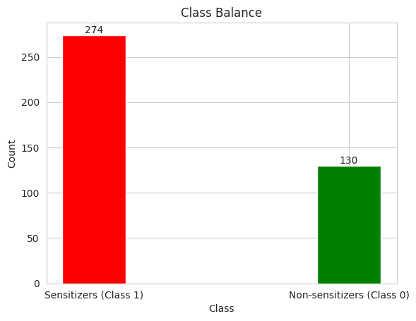
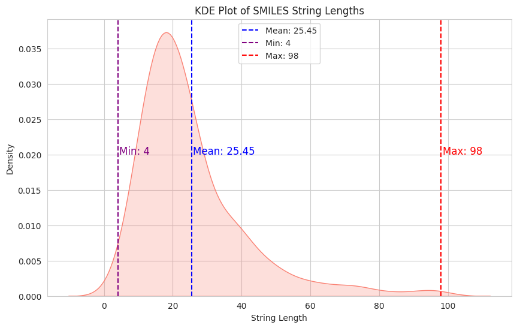
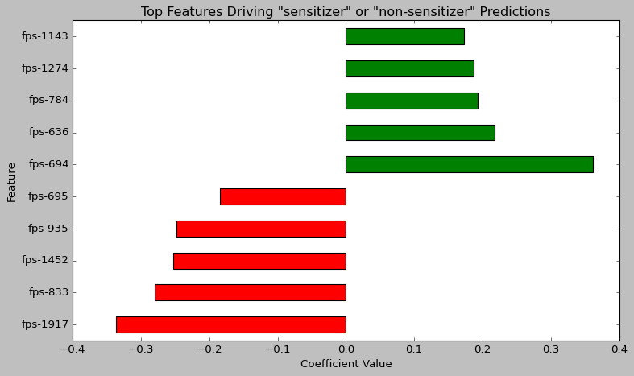
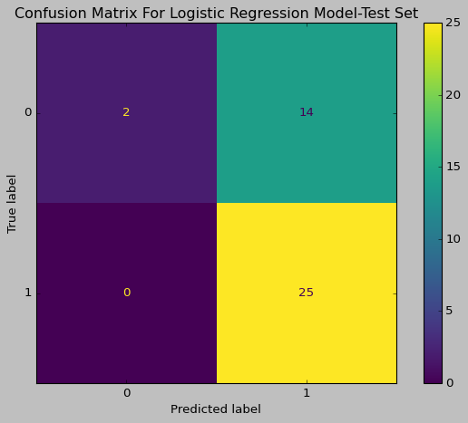
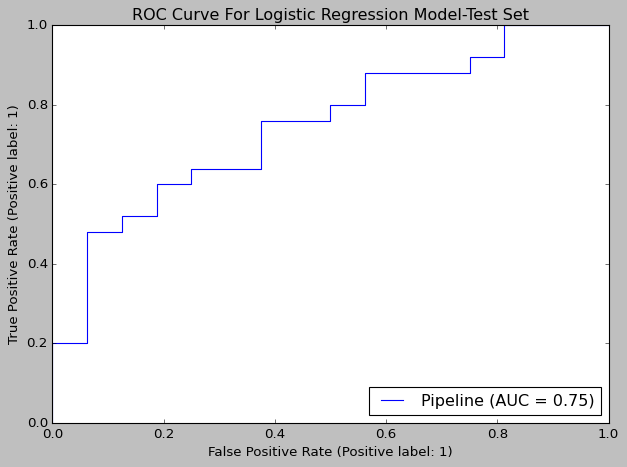
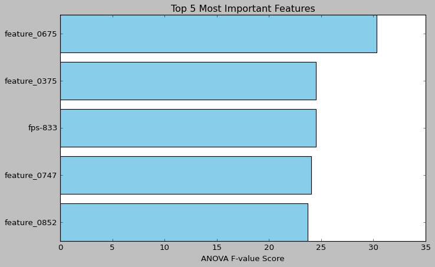
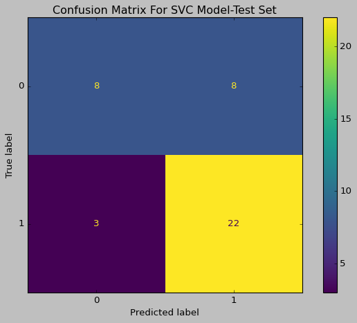
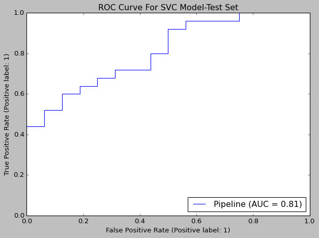
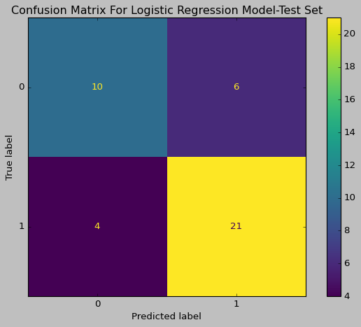
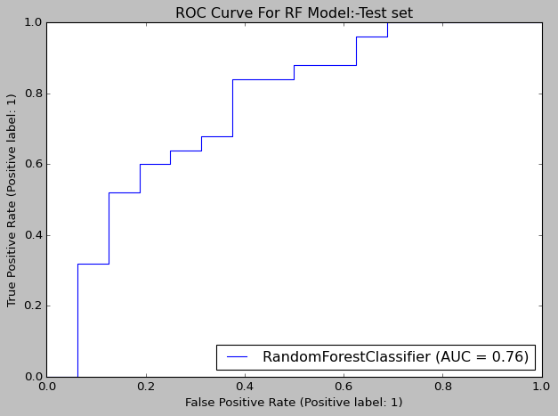

## Contents
- [Dataset](#dataset-chemically-induced-skin-reactions)
- [Exploratory Data Analysis](#exploratory-data-analysis-eda)
- [Selecting Featurisers](#featurizer-selection)
- [Featurisation Instructions](#featurisation-instructions)
- [Data Modeling](#data-modeling)
- [Evaluating RF Top Performing Model](#evaluating-rf-top-performing-model)
- [Saving Models](#saving-models)
- [Running a Model Prediction](#running-a-model-prediction)
- [Project Structure](#project-structure)


## Dataset: [Chemically-induced Skin Reactions](https://tdcommons.ai/single_pred_tasks/tox#skin-reaction)

### Dataset Overview
The data endpoint is to identify skin sensitizers => substances that can cause allergic [contact dermatitis (ACD)](https://ntp.niehs.nih.gov/whatwestudy/niceatm/test-method-evaluations/skin-sens) in humans through an immune response triggered by attaching chemicals to [skin proteins](https://ntp.niehs.nih.gov/whatwestudy/niceatm/test-method-evaluations/skin-sens/easa/easa) resulting from repeated exposure in susceptible individuals. The dataset is set for binary **classification** tasks, where each drug is represented by its SMILES string and labeled as either causing a skin reaction (1) or not (0). Allergic skin reactions can appear in the form of redness, swelling, or itching in humans. The data collected results from tests to facilitate the evaluation of alternative methods to predict reactions without using humans or animals.


### Data Source
Data was collected from non-animal defined approaches (DAs). Chemical tests like ([DPRA](https://ntp.niehs.nih.gov/whatwestudy/niceatm/test-method-evaluations/skin-sens/da)))=> measures how chemicals bind to skin proteins. Tests for skin cells that check if chemicals trigger inflammation signals in human skin cells like [KeratinoSens](https://ntp.niehs.nih.gov/whatwestudy/niceatm/test-method-evaluations/skin-sens/da). Immune cells test [h-CLAT](https://ntp.niehs.nih.gov/whatwestudy/niceatm/test-method-evaluations/skin-sens/da) that detects chemicals that activate allergy-related immune cells. Then tests were grouped to a  workflow (OECD guidelines) and their results were:

- Compared to **past human skin data** ([HPPT](https://ntp.niehs.nih.gov/whatwestudy/niceatm/test-method-evaluations/skin-sens/hppt)) and **animal test data** ([LLNA](https://ntp.niehs.nih.gov/whatwestudy/niceatm/test-method-evaluations/skin-sens/llna)) to confirm accuracy.

-  Combined using **agreed-upon rules** (from [multi-lab studies](https://www.sciencedirect.com/science/article/abs/pii/S0041008X14004529)) to create final labels (1=allergen, 0=nott allergen).

### Dataset Size:
- 404 drugs in the form of SMILES strings.

### Dataset Split method (may get changed in Hyperparameter Tuning):
Scaffold groups compounds by core structure, ensuring the model is evaluated distinct chemicals. I also used it For consistency with domain best practices,
I set the seed to the good number 42 for reproducability.
I used 80/10/10 split to allocate more data for the training set thus giving enough data for model learning.
### Data Limitations:
1) Data Size (404 compounds):
    - Predictions are as good as the training data. Small dataset may miss chemical diversity, leading to poor predictions for structurally distinct compounds.
2)  [Applicability Domain (AD):](https://www.sciencedirect.com/topics/pharmacology-toxicology-and-pharmaceutical-science/applicability-domain)
    - Models trained on this data may fail for molecules with structures too different from the training data (e.g., new types of atoms/bonds), requiring AD checks("warning" to spot nonsimilar cases) to flag unreliable predictions.
### Dataset License:
- [CC BY 4.0.](https://creativecommons.org/licenses/by/4.0/)

#### Concepts & Abbreviations:
- **susceptible individuals:** Refer to those who are genetically predisposed to developing allergic reactions upon repeated exposure to chemical agents

- **Applicability Domain (AD)**: Chemical space where the model's predictions are reliable. Domain is determined by Model descriptors and responses.

### **Why This Dataset?**
I chosed this dataset because it connects to everyday life. Think of reactions to cosmetics, detergents, or skincare products. Skin issues are universal. This dataset helps predict chemical safety without relying heavily on animal testing, aligning with my interest in ethical alternatives. It’s also a classifier (safe vs. unsafe) and the models built from it could be easier to interpret. The size dataset is manageable for my computational setup. By working on this, I’m tackling a real-world problem that blends health, consumer products, and sustainability which feels both meaningful.
__________________

## Exploratory Data Analysis (EDA)

Although direct analysis on raw SMILES strings is hard. I did some EDA to prepare for featurization and to identify issues or biases in the data that could impact model performance.


Initial exploration to understand the dataset's basic structure & content.

### 1. Dataset Dimensions

The dataset has **404 entries (rows)**, each representing a unique chemical compound, and **3 features (columns)**.

### 2. Data Columns and Types:

A summary of the dataset columns, their data types, and non-null counts is provided below:

| Column  | Non-Null Count | Dtype  | Description                           |
|---------|----------------|--------|---------------------------------------|
| Drug_ID | 404            | string | Identifier for the chemical compound  |
| Drug    | 404            | string | chemical SMILES string.               |
| Y       | 404            | int64  | Target label (1: Reaction, 0: No Reaction) |

**Findings:**

* Analysis confirms that there are **no missing (null) values** in all 404 entries. This indicates good data and simplifies the initial preprocessing steps. no imputation is needed for missing values.

________________________
### 3. Data Uniqueness

I checked the uniquenes of data values for each column to assure no duplicates.

| Column  | Unique Values | Observation                                            |
|---------|---------------|--------------------------------------------------------|
| Drug_ID | 404           | All identifiers are unique.                            |
| Drug    | 404           | SMILES strings (representing molecules) are unique.    |
| Y       | 2             | Target has 2 distinct values (0 and 1).                |

**Key Findings:**

* 404 unique values in both the `Drug_ID` and `Drug` columns, matching the total number of rows (404), confirming that **each entry represents a unique chemical compound**. There are no duplicate molecules in the data.
* predictor variable `Y` has 2 unique values consistent with the **binary classification**.
____________________________________________

### 4. Class Distribution (Target Variable Balance)

The `Y` target variable's distribution , tells if a chemical causes a skin reaction.I checked it to see if it has imbalance.

* **Class 1 (Sensitizers - Causes Reaction):** `274` samples
* **Class 0 (Non-sensitizers - No Reaction):** 130 samples

approximates to:
* 67.8% Class 1 (Sensitizers)
* 32.2% Class 0 (Non-sensitizers)

The class distribution is visualized in the bar plot below:



*Figure 1: Distribution of samples across the two classes.*

**Key Finding:** There's a **class imbalance**. The positive class (1, Sensitizers) got more than twice as many samples (274) as the negative class (0, Non-sensitizers) (130). This imbalance (ratio ≈ 2.1:1) is significant and needs to be considered during modeling. Training a model on this data without accounting for imbalance can lead to a bias towards predicting the majority class (Sensitizers). I will try some resampling (SMOTE, over/under-sampling) or class weights during training. Evaluation metrics sensitive to imbalance, like the F1-score or Precision-Recall AUC.
_________________________

### 5. SMILES String Length Analysis

To get an idea of molecular size and complexity, I analyzed the length of SMILES strings in `Drug` column.

**SMILES string lengths escriptive stats:**:

| Statistic         | Value |
|-------------------|-------|
| Count             | 404   |
| Mean Length       | 25.4  |
| Standard Deviation| 15.9  |
| Minimum Length    | 4     |
| 25th Percentile   | 15.8  |
| Median (50%)      | 22.0  |
| 75th Percentile   | 30.0  |
| Maximum Length    | 98    |

**Distribution Insights:**

Histogram with summry stats to show length distribution:


*Fig 2: Distribution (Hist & KDE) of SMILES string lengths, showing Mean, Min, and Max.*

* **Typical Molecule Size:** The median length is 22 characters, and the histogram/KDE plot peaks between approximately 10 and 25 characters. This suggests significant portion is of relatively small molecules. 50% of the molecules have SMILES lengths between ~16 and 30 characters (IQR).
* **Variability and Skewness:** The distribution is **right-skewed**, as indicated by the mean (25.4) > than the median (22) and the long tail extending to higher lengths. This skewness highlights the presence of some large complex molecules.
* **Range:**: 4 to 98 is a wide range of lengths. Big Standard deviation (15.9 relative to the mean), shows great diversity in molecular size/complexity.

**Key Finding:** Data has lots of small-to-medium-sized molecules but also includes a number of larger, maybe more complex structures. our Data is considerd hetrognieous.
_________________________________________________________

### Featurizer Selection


Starting my search journey,

I initially considered `[eos4avb](https://github.com/ersilia-os/eos4avb)` from Ersilia's hub, which claims readiness for **drug toxicity** prediction, but decided not to go with for these:

- **Different Endpoint**: Designed for broad bioactivity prediction for multiple domains, unlike my nuanced immune triggered skin sensitization.
- **Model Input Data**: It uses molecule images but may lose chemical interactions and details essential for predicting protein-chemical binding and inflammatory responses.
- **Dataset Limitations**: My small dataset requires precise feature extractor, while this general image approach may not capture reliable skin perdictions.

After a review of available featurizers, considered task requirements (predicting immune-triggered skin sensitization on a small, heterogeneous data).I identified Featurizers that aren't suitable for this Task like reaction transformers, format converters, text generators, translators and image-based models.


**I narrowed down to these 2 models:**

Those two selected featureizers work together to surpass challenges revealed by EDA on our small dataset like class imbalance, small sample size, and heterogeneity in molecule sizes.

1) **[Compound Embeddings](https://www.nature.com/articles/s41467-023-41512-2)**: use transfer learning that's good for my small dataset to generate 1024D vectors that integrate both physicochemical and bioactivity data. This model got knowledge from millions of compounds trained on [FS-Mol](https://www.microsoft.com/en-us/research/publication/fs-mol-a-few-shot-learning-dataset-of-molecules/?utm_source=chatgpt.com) and [ChEMBL](https://www.ebi.ac.uk/chembl/?utm_source=chatgpt.com) datasets, mitigating my small dataset and capturing complex relations like protein binding and immune response that causes skin sensitization. This featuriser outputs 1024 float features.

2) **[Morgan Fingerprints](https://research.ibm.com/publications/morgangen-generative-modeling-of-smiles-using-morgan-fingerprint-features?utm_source=chatgpt.com)**: Most widely used molecular representation and outputs a 2048-dimensional binary vector, capturing structural features around atoms. This is important in skin reactions prediction, where specific reactive locations determine the outcome. It's already validated against so many toxicity studies [[comparision between molecular fingerprints and other descriptors ](https://pubs.acs.org/doi/10.1021/acs.chemrestox.0c00303?utm_source=chatgpt.com)] making it reliable basline. the binary representation of its 2048 features assures fast computation and easy integration to ML workflows. Morgan generates 2048 dimensions of binary data.


Together, these approaches offer a balanced view: the embeddings bring in a holistic, data-enriched perspective while Morgan Fingerprints guarantee the capture of fine-grained chemical details. This strategy is designed to achieve model generalization accuracy, addressing the limitations and biases identified during EDA.
____________
### Featurisation Instructions:

The [`data_loader_and_featurizer.py`](scripts/data_loader_and_featurizer.py) takes your chemical data, splits it into meaningful subsets model-ready, and generates featurised[`data files`](data/) to capture molecular information. Here’s how it works:

- **Data Preparation** – It obtains Skin Reaction dataset and divides it into three parts: training, validation, and test splits. These subsets are saved as separate files, each contains both feature data (the unique compound identifiers) and their labels.

- **Feature Generation** – Once data is split, the pipeline runs a featurisation step. where a chosen fetched model (e.g:Morgan fingerprints based) processes the obtained input data files and set output file names.

- Output for Analysis – After processing, outputed new versions of dataset split files  are stored in the same [`data directory`](data/) for easy access.

Users need to run the [`data_loader and featurizer`](scripts/data_loader_and_featurizer.py) script to laod raw data from [TDC](https://tdcommons.ai/single_pred_tasks/tox#skin-reaction) then run the featurisation function within notebook by giving it a **fetched** model and file names.

## Data Wrangling
Generally, I didn't do any data wrangling because, clearly, the data was already clean and ready for AI models.

I experimented with various data scalers (`StandardScaler`, `RobustScaler`, `MinMaxScaler`) on the continuous compound embedding features to improve model performance. However, these transformations led to adverse outcomes, so I proceeded without scaling.

I also refrained from using under/over sampling techniques as it will exclude some of our data points that of course could convey some valuable informating to our models and decided to instead do hyperparameter tuning techniques like GridSearchCV to tune model parameters and improve generalization.

# Data Modeling
- I've modeled my data with **four** models (actually three):

    1. A **Baseline Model** => Dummy Classifier that makes predictions based on class distribution.
    **Classical ML Models**:
    2. **Logistic Regression** (baseline, linear and interpretable model)
    3. **Support Vector Machine (SVC)** (a bit non-linear and effective for high-dimensional spaces)
    4. **Random Forest** (ensemble model for complex patterns)

- **Model Development Workflow:**
    1. **Baseline Model Training**: The Initial model is trained with default parameters as benchmarks.
    2. **Hyperparameter Tuning**: Optimized models using techniques like GridSearch, cross-validation with (10-fold)...
    3. **Final Evaluation**: Assessed tuned model on the held-out test set.

- **Evaluation Metrics:**

    1) **Accuracy** (overall correctness)
    2) **Precision** (minimizing false positives)
    3) **Recall** (minimizing false negatives)
    4) **F1-Score** (harmonic mean of precision and recall)
    5) **ROC-AUC** (model’s ranking capability across thresholds)
## Baseline Model

To establish a baseline for model's performance, I used a stratified dummy classifier that makes predictions based on the majority class proportion. This approach ignores the input features and predicts the majority class. The baseline accuracy is calculated as the proportion of the majority class in the dataset.


I then trained the Dummy Classifier on the data and evaluated its performance.

| Metric             | Value   |
|--------------------|---------|
| **Accuracy**       | 55.8%   |
| **Precision**      | 56.0%   |
| **Recall**         | 77.0%   |
| **F1 Score**       | 65.0%   |
| **ROC AUC**        | 52.8%   |


This indicates that a random classifier would achieve an accuracy of 67.8% by simply predicting the majority class and **fall short** on **ROC**. The goal is to develop a model that outperforms this baseline and provides more accurate predictions for skin sensitization.

This helps us understand the minimum performance we should aim to improve upon.


## 🔧 Model Tuning Setup (Used Repeatedly)

I used a repeated workflow throughout the project  notebook to tune and evaluate different models.
It includes:

- **Stratified 10-Fold Cross-Validation** to ensure balanced class distribution in each fold.
- **Manual hyperparameter tuning** by adjusting the model parameters directly in the code.
- **Brute-force Grid Search (externally run)** on *Google Colab* with an extended range of hyperparameters, used at certain points to guide manual tuning.
- **Feature selection** using `SelectKBest` to reduce dimensionality before fitting the model.
- **Custom scoring metrics** such as accuracy, ROC_AUC, precision, and recall, evaluated using cross-validation. For each metric, the **average and standard deviation across folds** are printed for both training and test folds.

This setup helped me to understand the generalization and the overfitting behavior of models.
_____________
## **Classic ML models**
- Let's start our model building with some linear models and finish with a tree-based model.
### 1)  Logistic Regression
Let's first start with our good old friend, Logistic Regression!

- **Untuned Model Performance:**

    | Metric          | Training | Validation  |
    |-----------------|--------------|----------------|
    | Accuracy        | 99.07%       | 42.50%         |
    | Precision       | 98.70%       | 48.00%         |
    | Recall          | 100.00%      | 54.55%         |
    | F1 Score        | 99.34%       | 51.06%         |
    | ROC AUC         | 99.78%       | 50.51%         |

- **Tuned model Performance:**
    I retrain and evaluate the model using the best-found hyperparameters from tuning.
    Compared to the default configuration:

    - Selected top 900 features using `SelectKBest(f_classif)`
    - Logistic Regression with:
    - `C = 0.09` (regularization strength)
    - `penalty = "elasticnet"` with `l1_ratio = 0.2`
    - `solver = "saga"` for compatibility with elastic net
    - `warm_start = True` for faster convergence
    - `max_iter = 800` to limit iterations and reduce the severe overfitting on training data

    | Metric           | Training Set | Validation Set |
    |------------------|--------------|----------------|
    | Accuracy         | 77.09%       | 65.00%         |
    | Precision        | 75.59%       | 62.50%         |
    | Recall           | 99.56%       | 90.91%         |
    | F1 Score         | 85.93%       | 74.07%         |
    | ROC AUC          | 83.76%       | 61.11%         |

- **Model Performance on Testing Data:**

    | Metric         | Test Set |
    |----------------|----------|
    | Accuracy       | 65.85%   |
    | Precision      | 64.10%   |
    | Recall         | 100.00%  |
    | F1 Score       | 78.13%   |
    | ROC AUC        | 75.25%   |
Tuned logistic regression maintains 66% accuracy with 75% ROC_AUC, showing consistent generalization (test ≥ validation scores).

- **Feature Importance**

    

The chart shows top features of the logistic model's decisions.

- **Green bars** (positive coefficients) associated with predicting *non-sensitizers*.
- **Red bars** (negative coefficients) associated with predicting *sensitizer*.

Notably, all features on the y-axis are prefixed with `fps-`, signifying fingerprint-based features. This suggests that our model sees Morgan fingerprint featurizer's data as more prominent in model performance than compound embeddings.

- **🧮 Confusion Matrix:**

    

    model performs well overall on the test set, with 14 out of 41 predictions misclassified. However, it struggles more with the non-sensitizer class (0), exhibiting 14 false positives while having zero false negatives for the sensitizer class (1).  This suggests a potential bias towards predicting the positive class due to imbalanced data.

- **ROC Curve Insights**

    

    - The curve plots the true positive Rate `(TPR)` against the False Positive Rate `(FPR)`,  shows moderate model performance with an AUC of 0.75, indicating it's better than random gussing but could be improved.

    - The jagged, stair-step shape suggests the model's predicted probabilities are not well-calibrated. This means model's confidence scores may not accurately reflect the true likelihood. **E.g.** When the model says "I'm 60% confident this is a positive result", in reality (when it gives that 0.6 prediction), the actual outcome is positive more or less often than 60% of the time.
_____________________

### 2) SVC (Support Vector Classifier)

Next, I will switch to a SVC since logistic regression didn't perform well. SVC is a bit more complex and offers non-linear decision boundaries and high-dimensional data.

- **Untuned Model Performance:**
    First, an untuned `SVC` model to set a performance floor and measure how much later tuning improves results.

    | Metric         | Training Set | Validation Set |
    |----------------|--------------|----------------|
    | Accuracy       | 92.26%       | 62.50%         |
    | Precision      | 90.40%       | 60.00%         |
    | Recall         | 99.56%       | 95.45%         |
    | F1 Score       | 94.76%       | 73.68%         |
    | ROC AUC        | 99.50%       | 74.75%         |

- **Tuned model Performance:**

    I train the model using the best-performing parameters found during tuning. The pipeline includes feature selection using `SelectKBest` with `f_classif`, selecting the top 1550 features, followed by an SVM classifier (`SVC`) with the following settings:

    - `C = 0.32`: Controls the trade-off between margin size and classification accuracy. Lower values allow a softer margin, helping to avoid overfitting.
    - `max_iter = 23`: Limits iterations the optimizer runs. Helps reduce training time and can act as a form of early stopping.
    - `random_state = 42`: fixing the model's randomness for reproducability.
    - `probability = True`: Enables probability predictions (instead of just class labels), required by `roc_auc_score` function to calculate ROC

    | Metric         | Training Set | Validation Set |
    |----------------|--------------|----------------|
    | Accuracy       | 79.88%       | 70.00%         |
    | Precision      | 81.89%       | 69.23%         |
    | Recall         | 91.63%       | 81.82%         |
    | F1 Score       | 86.49%       | 75.00%         |
    | ROC AUC        | 85.04%       | 79.29%         |

- **Model Performance on Testing Data:**

    | Metric         | Test Set |
    |----------------|----------|
    | Accuracy       | 73.17%   |
    | Precision      | 73.33%   |
    | Recall         | 88.00%   |
    | F1 Score       | 80.00%   |
    | ROC AUC        | 80.75%   |

    Indicates the percentage of correct predictions out of all test examples.
    - **Precision**: 73.33%
    Higher precision reduces false positives.
    - **Recall**: 88.00%
    Higher recall reduces false negatives.
    - **F1 Score**: 80.00%
    Harmonic mean of precision and recall. A balanced metric when both false positives and false negatives matter.
    - **ROC AUC**: 80.75%
    Evaluates model's ability to distinguish between classes across all thresholds. An AUC close to 1.0 indicates strong separability.

- **Feature Importance**

    

    Observing feature importance scores. They aren't directly interpretable in this context since we can't know what feature 4243 actually represents.

    **However, we can note an interesting pattern:** as we use more non-linear models, we begin to see greater importance being assigned to those non-linear `float`-type features generated by our compound embeddings featurizer!

- **🧮 Confusion Matrix:**

    

    In the matrix:
    - The **top-left (8)** represents **true negatives**: correctly predicted class 0.
    - The **bottom-right (22)** shows **true positives**: correctly predicted class 1.
    - The **top-right (8)** are **false positives**: class 0 incorrectly predicted as class 1.
    - The **bottom-left (3)** are **false negatives**: class 1 incorrectly predicted as class 0.

    Imbalanced data in favor of class 1 (Sensitizers) makes high recall expected. This matrix confirms capturing most positives, though it misclassifies some negatives, highlighting a trade-off in precision.

- **ROC Curve Insights**

    

    ROC curve below visualizes my SVC's ability to distinguish between classes (**"1" vs "0"**) at different classification thresholds.

    - **(AUC = 0.81)** => Better than most baseline models:

    - Curves sharply toward the top-left. → Strong separability
    - **Practical meaning**: 81% chance model ranks a random positive instance higher than a random negative one.
________________________________________

### 3) Random Forest_Top Performing Model🏅

After tried both Logistic Regression and Support Vector Classifier, I turned to a tree-based ensemble model: **Random Forest**. As the saying goes, _"two heads are better than one"_—and Random Forest takes that to the next level with **n_estimators** working together.

Unlike LR and SVC, RFs capture **complex relationships** without manual feature engineering or choosing kernels.it's **less sensitive to noise and outliers**.

Strengths of Random Forest:
- **Handles high-dimensional input** effectively.
- Doesn’t assume linearity (unlike LR or SVC).
- Automatically selects informative features via **feature bagging**.
- Requires **minimal preprocessing** or heavy data **scaling** or transformations.
- Well-suited for datasets like mine, which include a wide range of **SMILES lengths** (4–98, std dev ≈ 15.9), which can destabilize strong models.


- **Untuned Model Performance:**
    First, an untuned `RF` model to set a performance floor and measure how much later tuning improves results.

    | Metric         | Training  | Validation
    |----------------|--------------|----------------|
    | Accuracy       | 100.00%      | 62.50%         |
    | Precision      | 100.00%      | 61.29%         |
    | Recall         | 100.00%      | 86.36%         |
    | F1 Score       | 100.00%      | 71.70%         |
    | ROC AUC        | 100.00%      | 61.11%         |

- **Tuned model Performance:**

    - `criterion = 'gini'`: Uses Gini impurity measure to evaluate splits. It's computationally efficient and typically performs well for classification tasks.
    - `n_estimators = 16`: A relatively small number of trees to reduce training time and overfitting while still benefiting from ensemble averaging to lower variance.
    - `max_depth = 12`: Limits how deep each tree can grow, helping to prevent overfitting and encouraging generalization by restricting overly complex patterns.
    - `random_state = 42`: Ensures reproducibility of results by controlling the randomness in bootstrapping and feature selection.

    This setup balances complexity and generalization while keeping the model deep enough to capture patterns in the data without overfitting

    | Metric         | Training Set | Validation Set |
    |----------------|--------------|----------------|
    | Accuracy       | 99.69%       | 70.00%         |
    | Precision      | 99.56%       | 69.23%         |
    | Recall         | 100.00%      | 81.82%         |
    | F1 Score       | 99.78%       | 75.00%         |
    | ROC AUC        | 100.00%      | 75.00%         |


- ### Evaluating RF Top Performing Model🏅:

    | Metric         | Test Set |
    |----------------|----------|
    | Accuracy       | 75.61%   |
    | Precision      | 77.78%   |
    | Recall         | 84.00%   |
    | F1 Score       | 80.77%   |
    | ROC AUC        | 76.00%   |

    📊 **Test Set Metrics**
    - **Accuracy**: 75.6% — indicates the overall proportion of correct predictions.
    - **Precision**: 77.8% — reflects that nearly 78% of positive predictions were correct.
    - **Recall**: 84% — shows the model successfully identified 84% of all actual positives.
    - **F1 Score**: 80.8% — the harmonic mean of precision and recall, balancing both aspects.

    - It maintained a better balance across all metrics
    - It achieved higher precision without sacrificing too much recall.

    *advantages over other models*:
    ✓ Better at capturing true negatives **(minority class)**
    ✓ Improved precision-recall balance
    ✓ More consistent performance across metrics


- **🧮 Confusion Matrix:**

    

    - **Strong specificity**: Correctly predicted **22 sensitizers** (true positives, class `0`), but missed **6** (false positives).
    - **High recall for non-sensitizers**: Captured **10 true negatives** (class `0`), with only **4 false negatives**, aligning with the high recall (84%) observed earlier.
    - **Precision trade-off**: While recall is robust, the **6 false positives** (class `0` predicted as `1`) explain the precision score of 77.

- **ROC Curve Insights:**

    

    - **ROC (Receiver Operating Characteristic)** visualizes the performance of RF classifier by plotting **True Positive Rate (Recall)** against the **False Positive Rate** at various threshold settings.

    - **AUC (Area Under Curve)** is **0.76**, indicating that the model has a **76% chance of correctly distinguishing between the positive and negative classes**.

    - The model **leans slightly toward recall**, meaning it's favoring capturing as many positives as possible, which is expected given the imbalanced nature of our data.

    - Given the **balance between precision and recall** and a solid ROC AUC, the Random Forest model demonstrates **strong and balanced performance**.

    - **ROC curve shape** arcs toward the top-left corner, reinforcing that the classifier is **making well-calibrated decisions across thresholds**.


- **Feature Importance:**

    Observing feature importance scores. They aren't directly interpretable in this context since we can't know what feature 4243 actually represents.

    **However, we can note an interesting pattern:** as we use more non-linear models, we begin to see greater importance being assigned to those non-linear `float`-type features generated by our compound embeddings featurizer!

    

Sure! Here's a more professional and polished version of that section for your README:

---

## Saving Models

The project includes three trained models, saved using `joblib` for efficient reuse in future scripts or applications. These serialized models are stored in the `models/` directory:

- `lr_model.joblib` — Logistic Regression model
- `rf_model.joblib` — Random Forest model
- `svc_clf_model.joblib` — Support Vector Classifier (SVC) model

These files can be loaded independently as needed for prediction or evaluation tasks.


---

## Running a Model Prediction

To predict whether a molecule is a skin sensitizer, use the interactive `run_model.py` script. It takes a SMILES string as input, processes it using pre-trained featurizers, and feeds the result into a Random Forest model to generate a prediction.

#### Usage

From the `scripts/` directory, run:

```bash
python run_model.py
```

You'll be prompted to enter a SMILES string:

```
Enter a SMILES string (or type 'quit'/'q' to exit): C=C(C=CCC(C)C)CC
```

The script then will then:
1. Save the input to a temporary CSV file
2. Generate molecular features using two different featurizers
3. Load the trained model and perform a prediction

### Output

After processing, the script prints a clear prediction:

```
🟢 The molecule: C=C(C=CCC(C)C)CC is predicted to **not be a skin sensitizer**.
```

You can re-run the script and test different molecules interactively.

---

## Project Structure

```
./
├── LICENSE                      # License for the project
├── README.md                   # Project documentation
├── data/                       # Processed datasets and features
│   ├── ComPEmbed_train_features.csv     # CompEmbed train set
│   ├── CompEmbed_test_features.csv      # CompEmbed test set
│   ├── CompEmbed_valid_features.csv     # CompEmbed validation set
│   ├── morgan_train_features.csv        # Morgan train features
│   ├── morgan_test_features.csv         # Morgan test features
│   ├── morgan_valid_features.csv        # Morgan validation features
│   ├── skin_reaction.csv                # Original data file
│   ├── skin_reaction.tab                # Original data (tab-delimited)
│   ├── test_features.csv                # Final test features
│   ├── test_labels.csv                  # Final test labels
│   ├── train_features.csv               # Final train features
│   ├── train_labels.csv                 # Final train labels
│   ├── valid_features.csv               # Final validation features
│   └── valid_labels.csv                 # Final validation labels
├── models/                     # Serialized machine learning models
│   ├── lr_model.joblib                 # Logistic Regression model
│   ├── rf_model.joblib                 # Random Forest model
│   └── svc_clf_model.joblib            # Support Vector Classifier
├── notebooks/                 # Jupyter notebooks for experimentation
│   └── SkinReaction_EndToEnd_Pipeline.ipynb   # Main project notebook
├── pyproject.toml             # Project metadata and dependencies
├── scripts/                   # Core scripts for processing and prediction
│   ├── __pycache__/                  # Compiled Python cache (ignored)
│   ├── data_loader_and_featurizer.py  # Feature & extraction logic
│   ├── run_model.py                  # Interactive prediction script
│   └── utils.py                      # Helper utility functions
images/                        # Image assets..
```
---
